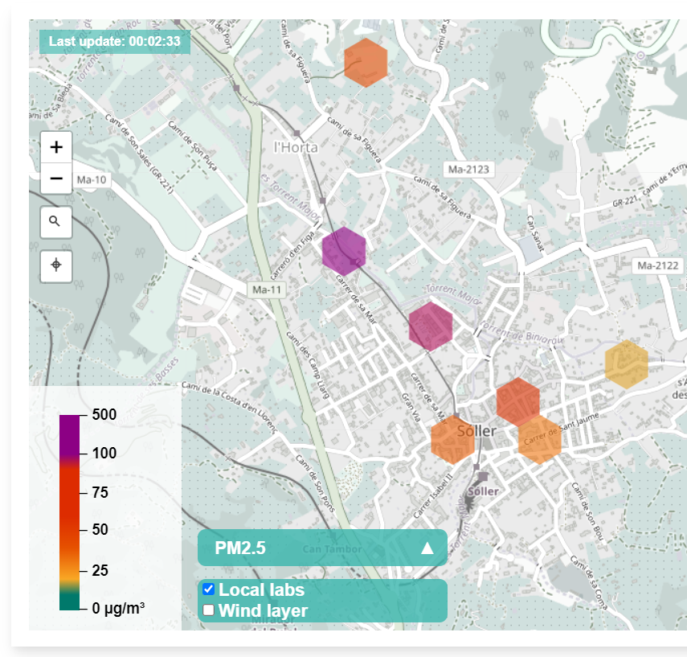
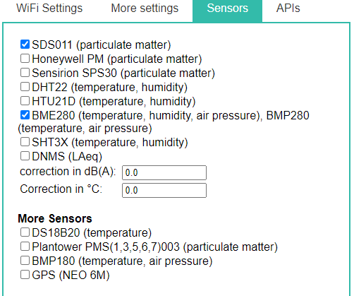
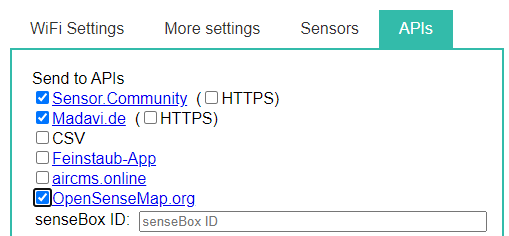
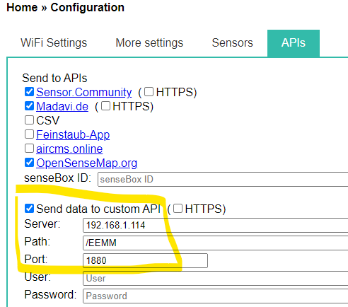

# Talleres IoT. Sensor de calidad del aire

En este taller vamos a construir un sensor que medirá los siguientes indicadores medioambientales:
* Concentración de partículas entre 0,3 a 10 μm en el aire
* Temperatura
* Humedad
* Presión atmosférica



El dispositivo está basado en un microcontrolador ESP8266 montado en una placa NodeMCU que permite conectividad WiFi. A través de la cual, los datos serán transmitidos a la plataforma abierta de [Sensor Community](https://sensor.community/es/). De esta forma, además de poder ver la información de nuestro dispositivo en una web. Estatemos dando a conocer una información interesante para otros ciudadanos y colaborando para la realialización de estudios climáticos que nos benefician a todos.

## ¿Cómo se detectan las partículas en el aire? 
Uso del principio de dispersión láser:
La dispersión de la luz puede ser inducida cuando las partículas pasan por el área de detección. La luz dispersa se transforma en señales eléctricas y estas señales se amplificarán y procesarán. El número y el diámetro de las partículas se pueden obtener mediante análisis porque la forma de onda de la señal tiene ciertas relaciones con el diámetro de las partículas.

## Lista de material


### Kit de sensores

-   [Kit de sensores predestinados](https://nettigo.eu/products/luftdaten-org-pl-kit-sds011-bme280)

### Componentes individuales

-   [NodeMCU ESP8266 CPU/WLAN](https://www.aliexpress.com/wholesale?groupsort=1&SortType=price_asc&SearchText=nodemcu+v3+esp8266+ch340)
    La placa base para NocdeMCUs v3 es normalmente CH341, comprueba la parte trasera de tu NodeMCU (ESP8266) para encontrar la información técnica.
-   [SDS011 Sensor de polvo fino](http://www.aliexpress.com/wholesale?groupsort=1&SortType=price_asc&SearchText=sds011)
-   BME280 6-PIN, temperatura, humedad y presión atmosférica.
    -   [via Aliexpress](https://www.aliexpress.com/wholesale?catId=0&initiative_id=SB_20200308040440&SearchText=bme280+-5V+%2B3.3V)
    -   [via Nettgio](https://nettigo.eu/products/module-pressure-humidity-and-temperature-sensor-bosch-bme280)
    -   [via Berrybase](https://www.berrybase.de/sensoren-module/feuchtigkeit/gy-bme280-breakout-board-3in1-sensor-f-252-r-temperatur-luftfeuchtigkeit-und-luftdruck?c=92)
-   [Cable](http://www.aliexpress.com/wholesale?groupsort=1&SortType=price_asc&SearchText=Dupont+cable+20cm+female-female)
-   [Cable USB por ejemplo: plano 2m Micro-USB](https://www.aliexpress.com/wholesale?catId=0&initiative_id=SB_20200308040708&SearchText=micro+usb+flat+cable+2m)
-   [Fuente de alimentación USB](https://www.aliexpress.com/wholesale?catId=0&initiative_id=SB_20200308040834&SearchText=single+micro+usb+eu+power+supply)
-   [Correas para cables](https://www.aliexpress.com/wholesale?catId=0&initiative_id=SB_20200308040852&SearchText=cable+straps)
-   Un tubo flexible y que no sea transparente. Con un diámetro de 6 mm y una longitud aproximada de 20 cm de la tienda de bricolaje
-   [Protección contra el mal tiempo, Marley Silent HT Abrc DN 75 87°](https://www.bauhaus.info/rohrsysteme/marley-ht-bogen-/p/13625028)

## Conectar el microcontrolador al ordenador

Una vez que tengamos el hardware. Empezaremos por instalar los drivers y conectar el NodeMCU(ESP8266).
Para comunicarse con el NodeMCU (ESP8266) necesitamos diferentes controladores en función del sistema operativo. Elige la url correspondiente al sistema operativo de tu ordenador.

### Windows

#### Drivers para NodeMCU (ESP8266) V2 (CP2102) en Windows

-   [Windows 10](https://www.silabs.com/documents/public/software/CP210x_Universal_Windows_Driver.zip) - Windows 10 - Windows 10 debería descargarlo automáticamente
-   [Windows 7/8/8.1](https://www.silabs.com/documents/public/software/CP210x_Windows_Drivers.zip) - 32-bit version - no soporta la versión 64-bit OS

#### Driver for NodeMCU (ESP8266) V3 (CH340/CH341) for Windows

-   [Windows](http://www.wch.cn/downloads/file/5.html) - Windows 10 debería descargarlo automáticamente

#### Extraer el archivo descargado para Windows:

-   Para el NodeMCU (ESP8266) V2: Abre la carpera CP210x y haz doble click en el archivo CP210xVCPInstaller_x64 (or x86)
-   Para el NodeMCU (ESP8266) V3: Abre la carpeta CH341SER y haz doble click en el archivo SETUP.

### MacOS

#### MacOS Drivers

-   [NodeMCU V2](https://www.silabs.com/documents/public/software/Mac_OSX_VCP_Driver.zip)
-   [NodeMCU V3](http://www.wch.cn/downloads/file/178.html)

#### Extrae el archivo descargado para MacOS.

-   Para V2: descomprime la carpeta CP210x y haz doble click en el archivo CP210xVCPInstaller_x64 (o x86)
-   for V3: descomprime la carpeta folder CH341SER y haz doble click en el archivo SETUP.
-   Reinicia tu Mac

### Linux

No es necesario instalar los drivers. El chip debe estar instalado (puedes verificarlo con dmesg)

## Firmware Flasher. Carga del programa.

Soporte para múltiples sistemas operativos: Windows, MacOS and Linux.

-   [airRohr Flashing Tool](http://firmware.sensor.community/airrohr/flashing-tool/)
-   [Source Code](https://github.com/opendata-stuttgart/airrohr-firmware-flasher/)

Conecta el NodeMCU a tu ordenador con un cable micro-USB (elige un cable que no sea más largo de 1 metro, si no, la instalación podría fallar). Selecciona latest_en.bin (o el lenguaje que prefieras) y haz click en "Upload". Espera hasta que finalice el proceso. Ahora puedes conectar el sensor.\

## Montaje
> ⚠️ NOTA IMPORTANTE Antes de hacer las conexiones, completra el paso anterior de instalar el firmware

### NodeMCU v3

Nota: estas instrucciones hacen referencia a la versión 3 del NodeMCU. Puede ser reconocido por las conexiones VU y G (ver el dibujo).


Este debería ser el resultado final:


### Cableado del SDS011

Los pins están numerados de DERECHA a IZQUIERDA, asegúrate al conectar los cables que están situados en los pins, ya que la mayoría de los cables Dupont encajan entre los pines.

```
SDS011 Pin 1 -> Pin D1 / GPIO5
SDS011 Pin 2 -> Pin D2 / GPIO4
SDS011 Pin 3 -> GND
SDS011 Pin 4 -> unused
SDS011 Pin 5 -> VU (NodeMCU v3) / VIN (NodeMCU v1,v2)
SDS011 Pin 6 -> unused
SDS011 Pin 7 -> unused
```

### Soldar el BME280


Conecta la cabeza del pin con el puerto BME280. Suéldalo desde la parte trasera. Los huecos entre los pins son muy pequeños, ten paciencia y cuidado. El truco está en soldar la punta de hierro al pin, calentarlo un poco y, entonces soldarlo con cuidado.


### Cablear el BME280

Los pins están numerados de IZQUIERDA a DERECHA

```
VIN -> Pin 3V3 (3.3V)
GND->  GND/G
SDA -> PIN D3
SCL -> Pin D4
```

### Montaje del sensor

#### Ata el NodeMCU y el SDS011 juntos


Usa un cable para conectar el NodeMCU (ESP8266) y el sensor SDS011 sensor para que la antena de Wifi emita desde el sensor.

#### Conecta el tubo flexible


- Conecta el tubo flexible al sensor SDS011 * Use otro cable conector para enganchar el sensor de temperatura BME280 al tubo * Pasa el cable USB a través del tubo. Monta el SDS011 con el NodeMCU hacia la parte de arriba y el ventilador hacia la parte de abajo ##### Pulsa el sensor en el tubo * Aprieta las partes en el tubo, así estará junto dentro. - El cable USB, el tubo flexible y el BME280 deben salir al final del tubo. * Aprieta el otro cable dentro del primero. 

#### Para acabar

-   Coloca el sensor de temperatura en el tubo flexible, así estará en el borde del cable.
-   Corta el tubo flexible y el final del cable.
-   Opcional: puedes cubrir las salidas del tuvo con una fina malla. Así el aire puede circular y los insectos no pueden entrar.


## Configurar

### Consigue la estación ID


1. Conecta la estación a un cable USB para cargar el sensor.
2. La estación intentará conectarse a la red WiFi configurada. Para una nueva configuración, la conexión fallará y la estación creará una red WiFi con el nombre: __Particulate Matter ID, Feinstaubsensor-ID o airRohr-ID__. El ID es el ChipID (por ejemplo, 13597771). Anota este número, ya que lo necesitarás para el registro
3. Conecta a la red Wifi creada por la estación (Hotspot) con tu ordenador o móvil. Espera hasta que se establezca la conexión.
   Usuarios de Android: Si la conexión se acaba inmediatamente, podrías tener desactivada la opción "Smart network switch" en "Connections -> WiFi -> Advanced".
4. Abre tu navegador y tecla la url siguiente <http://192.168.4.1/>.

> ⚠️ Ten en cuenta que el NodeMCU puede necesitar varios intentes para conectarse a la red WiFi local. Ten paciencia y realiza los pasos varias veces hasta que funcione. Si la configuración del sensor funciona, la red WiFi de la estación no estará disponible y la página de configuración ya no será accesible bajo esta IP 192.168.4.1

### Configurar la estación

1. En la página de 'Configuración' teclea el SSID (el nombre de la red WiFi de casa), la clave de seguridad de la red (en Windows) o la contraseña de WiFi.
2. Accede a la pestaña de __Sensors__ para seleccionar los sensores conectados: BME280 y SDS011


3. Ahora vamos a decirle a dónde queremos que se envién nuestros datos. Marca las opciones que desees en la pestaña de __APIs__



5. Haga clic en el botón 'Guardar configuración y reiniciar'. La estación se reiniciará y ya no será accesible de esta manera cuando se conecte a la red WiFi de su hogar.

### Verifica que la estación está correctamente configurada

Tras las configuraciones anteriores, el sensor comenzará a grabar y cargar los datos. Puede verificar que todo funcione correctamente después de aproximadamente 10 minutos dirigiéndote a las siguientes páginas. En estas páginas, busque el ChipID (en el ejemplo anterior 13597771).

-   [Sensor data](https://www.madavi.de/sensor/graph.php)
-   [WiFi signal data](https://www.madavi.de/sensor/signal.php)

## Registrarse

### Crea una cuenta

Ve a [devices.sensor.community](https://devices.sensor.community/) para crear una cuenta y conviértete en parte de la red Open Data.

### Registra tu dispositivo

Una vez creas una cuenta e inicias sesión, podrás registrar tu dispositivo. Completa el formulario para registrar tu dispositivo. Ve a Inicio -> (Iniciar sesión) - Sensores -> Registrar nuevo sensor

-   El ID del sensor es el ChipID del ESP8266 (NodeMCU) que anotaste antes
-   Tu dirección de correo electrónico no será publicada
-   Tu dirección: Calle con número de casa, código postal y ciudad. Haga clic en "Buscar dirección ingresada" para obtener las coordenadas de la ubicación. Compruebe la posición, cámbielo si es necesario
-   Establece un nombre de sensor personal para que sea más fácil separarlos si tienes varios sensores (como jardín, etc.)
-   Los alrededores de la estación (Ejemplo: altura sobre el suelo, lado de la carretera, alto volumen de tráfico, campo libre o similar)

## Integración don Node-RED


### Directa
El propio firmware del microcontrolador ESP8266 nos permite enviar la información también a un endpoint api-rest. Si el sensor y el servidor están en la misma LAN, la configuración es secilla:

Tenemos que tener en cuenta que no usaremos el puerto por defecto, el 80 si no el 1880, el propio Node-RED para los dashboards. El parseo de la información varia en función de los sensores colocados. Si se usa un BMP280 este sería el flujo:


-   ¿Está el sensor registrado en <https://devices.sensor.community/> y es el sensor visible en el mapa?
-   ¿Ha estado la señal WLAN en un nivel bajo en el pasado? Aquí está el servidor de registro de la señal: `https://api-rrd.madavi.de/grafana/d/Fk6mw1WGz/wifi-signal?orgId=1&var-chipID=esp8266-[ID]`

### [](https://sensor.community/airrohr/es#Problemas_con_el_cable_USB)¿Problemas con el cable USB?

-   Verifique la fuente de alimentación: cable USB
-   Reiniciar (desconecte la fuente de alimentación, por ejemplo, tire del enchufe USB)
-   ¿Está bien configurada la red WLAN? (el sensor se conecta a la WLAN configurada). De lo contrario:
    -   ¿El sensor abre un AP (en los primeros 2-7 minutos después de un reinicio)?
    -   Busca la red WLAN "airrohr-[ID]". Paciencia, puede tardar 1-2 minutos antes del reinicio.
-   Verifique en su propio rooter si el sensor está conectado a la red, luego recuerde la IP
-   Comprueba en tu propio router si el sensor está conectado a la red, entonces recuerda la IP
    -   De forma alternativa, usa "Discovery" en el [flashtool](https://github.com/opendata-stuttgart/airrohr-firmware-flasher//)
    -   Si es así: conéctalo al sensor mediante la IP con un navegador "http://[ip-of-the-sensor]/" , la interfaz debería aparecer
    -   Si no es así: el ESP tiene problemas. Puede ser un problema, por ejemplo de insuficiencia en el suministrador de energía. Reinicia.
-   Conecta el USB a un ordenador y comprueba el registro
    -   Rastrea el texto en la interfaz serial con el programa de terminal serial (Configuración: baudios 9600, 8N1)
        -   Linux: pantalla, minicom, cutecom; Windows: Tera Term; MacOS: pantalla, minicom, ...
        -   Posiblemente sean necesarios los drivers usb2serial, echa un vistazo a <https://github.com/opendata-stuttgart/meta/wiki/Firmware-einspielen>
    -   Ahí deberías poder ver qué está haciendo el sensor (mensajes de arranque, conexión WLAN o AP, medición, solo después de 3 minutos)

### [](https://sensor.community/airrohr/es#Problemas_electronicos)¿Problemas electrónicos?

-   Retira la electrónica del sensor de la carcasa y observe.
-   Comprueba/cambia el suministrador de energía de nuevo.
    -   ¿Emite un pequeño flash el ESP después de reiniciar?
    -   SDS011: LED roja/ventilador encendido después de reiniciar
    -   Reinicia (desconecta el suministrador de energía)

## Agradecimientos 🙋‍
[Associació de Veïnes de Canamunt](http://www.canamunt.org/)
[Piotr, from Poland](https://dropbox.inf.re/)
[Sensor.Community](https://sensor.community/)

**Gracias a todos por hacer del mundo un lugar mejor a través de datos ambientales abiertos y dirigidos por la comunidad.**
